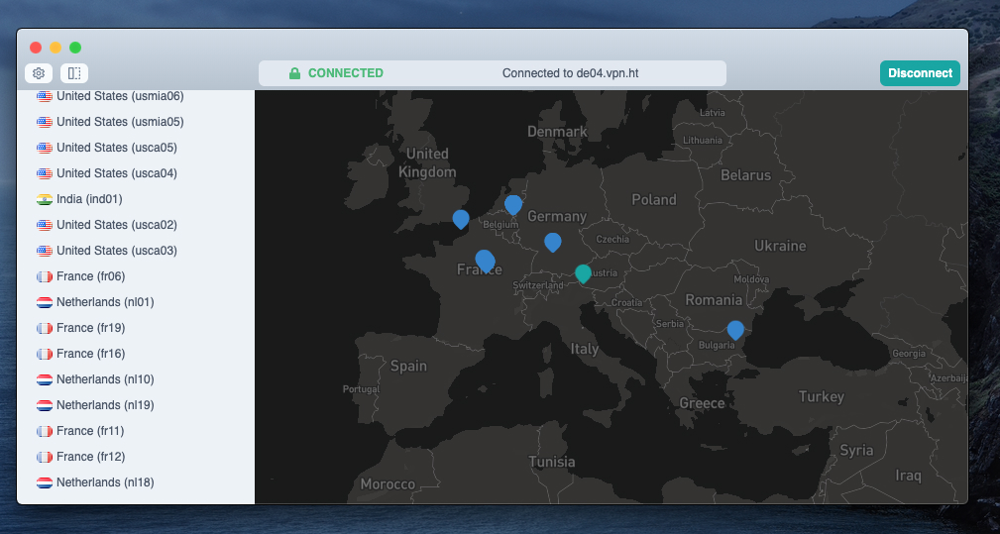

# VPNht/desktop

This repo is managed as a monorepo that is composed of many packages.
Each package has its own `README` and documentation describing usage.

This client is in development and not ready for production use.

### Package Index

| package |     |     |
| ------- | --- | --- |
| client       | [directory](packages/client)  |
| service      | [directory](packages/service) |
| sdk-js       | [directory](packages/sdk-js)  |  |

## License

&copy; [VPN.ht](https://vpn.ht/), see [LICENSE.md](LICENSE.md) for details.

